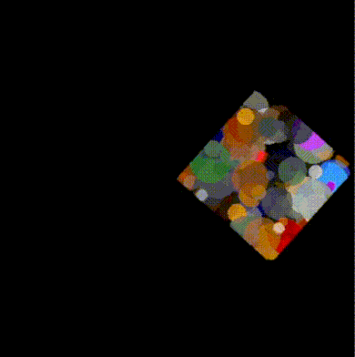

<a name="readme-top"></a>
<div align="center">
	<a href="./LICENSE">
		
	</a>
	<a href="https://github.com/LordOfTrident/pif/graphs/contributors">
		
	</a>
	<a href="https://github.com/LordOfTrident/pif/stargazers">
		
	</a>
	<a href="https://github.com/LordOfTrident/pif/issues">
		
	</a>
	<a href="https://github.com/LordOfTrident/pif/pulls">
		
	</a>
	<br><br><br>
	
	<h1 align="center">PIF</h1>
	<p align="center">🎨 Palettized image format and software renderer 🖼️</p>
	<p align="center">
		<a href="#documentation">Documentation</a>
		.
		<a href="#demos">Demos</a>
		.
		<a href="todo.md">Todo</a>
		·
		<a href="https://github.com/LordOfTrident/pif/issues">Report Bug</a>
		·
		<a href="https://github.com/LordOfTrident/pif/issues">Request Feature</a>
	</p>
	<br>
</div>

<details>
	<summary>Table of contents</summary>
	<ul>
		<li>
			<a href="#introduction">Introduction</a>
			<ul>
				<li><a href="#why">Why</a></li>
			</ul>
		</li>
		<li>
			<a href="#demos">Demos</a>
			<ul>
				<li>
					<a href="#pre-requisites">Pre-requisites</a>
					<ul>
						<li><a href="#debian">Debian</a></li>
						<li><a href="#arch">Arch</a></li>
					</ul>
				</li>
				<li><a href="#quickstart">Quickstart</a></li>
			</ul>
		</li>
		<li><a href="#documentation">Documentation</a></li>
		<li><a href="#bugs">Bugs</a></li>
	</ul>
</details>

## Introduction
**PIF** is a library for palettized [software rendering](https://en.wikipedia.org/wiki/Software_rendering)
(inspired by the [Doom](https://doomwiki.org/wiki/PLAYPAL) and [Quake](https://fabiensanglard.net/quake2/quake2_software_renderer.php)
palettized software renderers) and handling `.pif` (Palettized Image Format) files, `.pal` (Palette) files and `.pbf` (Palettized Bitmap Font) files.

### Why
While making a not-yet-published retro 256-color [3D raycaster engine](https://lodev.org/cgtutor/raycasting.html),
I found myself writing a lot of code for the palettized software rendering, image/palette file format
loading and text rendering. I had to make utilities to convert from `.bmp` files to my palettized image
files, utilities to view these palettized image files and more.

I realised I am probably going to do more palettized software rendering in the future, so I decided to
make a library for it to handle all of these things like image files, palettes, software rendering,
converting etc. Then I could make utilities for working with these image files, and reuse all of this
for every palettized software rendered game I make in the future. And so the idea of PIF was born.

## Demos
The [demos folder](demos) contains subfolders for [graphical](demos/sdl2), [textmode](demos/ncurses)
and [pure file IO](demos/fileio) demos.

<div align="center">
	
	
	
	
</div>

> [!NOTE]
> The terminal demos do not support Windows.

<div align="center">
	
</div>

### Pre-requisites
Demos are written in C and C++. PIF does not handle displaying images onto the screen, so the SDL2
and NCurses libraries are used for that in the demos.

The following is required to compile the demos:
- A C/C++ compiler
- Makefile
- NCurses
- [SDL2](https://github.com/libsdl-org/SDL)

#### Debian
```
$ apt install gcc g++ make libsdl2-dev ncurses
```

#### Arch
```
$ pacman -S gcc make sdl2 ncurses
```

### Quickstart
```sh
$ git clone https://github.com/LordOfTrident/pif
$ cd pif/demos/sdl2
$ make
$ ./dots3d
```

## Documentation
Coming soon.

## Bugs
Known bugs are listed in the [todo file](todo.md). If you find any more bugs, please,
[create an issue and report them](https://github.com/LordOfTrident/pif/issues).

<br>
<h1></h1>
<br>

<div align="center">
	<div align="center"></div>
	<br>
	<a href="https://en.wikipedia.org/wiki/C_(programming_language)">
		
	</a>
	<a href="https://www.libsdl.org/">
		
	</a>
	<p align="center">Made with ❤️ love</p>
</div>

<p align="right">(<a href="#readme-top">Back to top</a>)</p>
